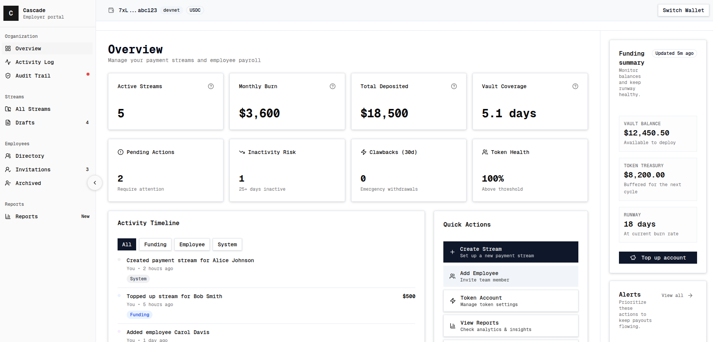

> built for the [colosseum hackathon](https://colosseum.com/hackathon). currently devnet/localnet focused—not production-ready.

a real-time payroll platform on solana that lets hourly workers withdraw vested earnings as they accrue, while employers retain funding controls and emergency clawback rights.

traditional payroll is periodic and delayed. cascade uses solana's speed and usdc stablecoins to enable continuous streaming—employers fund payment streams at an hourly rate, employees withdraw whenever they want without waiting for payday.

_employer dashboard (early build preview)_

the anchor program uses pda-derived vaults for custody and enforces time-based vesting math on-chain. next.js dashboard handles employer/employee workflows, postgres tracks off-chain state, and reconciliation workers sync chain state with the database. the interesting challenge is keeping ui state consistent with on-chain truth—transactions can succeed while db writes fail, so we built idempotent reconciliation with checkpoint-based resumption.

built this with [praxzy](https://github.com/praxzy) while learning solana program architecture.
