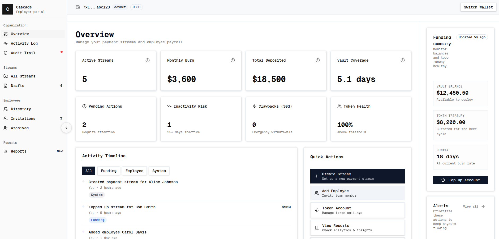

> built for the [colosseum hackathon](https://colosseum.com/hackathon). this is a devnet/localnet project, not a production payroll system.

cascade is a payroll experiment on solana. employers fund a payment stream at an hourly rate, and workers can withdraw the USDC they've earned so far. employers retain funding controls and emergency clawback rights.

_an early version of the employer dashboard_

the anchor program holds funds in PDA-derived vaults and calculates vesting on-chain. a next.js dashboard handles the employer and worker flows, while postgres stores off-chain state.

the part i found interesting was keeping those two views in agreement. a transaction can succeed on-chain while the database write fails. we used idempotent reconciliation workers with checkpoints, so a worker can resume without starting over or applying the same change twice.

i built this with [praxzy](https://github.com/praxzy) while learning how solana programs fit together.
