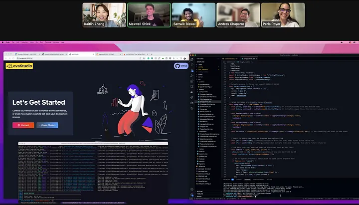

> this project was built during my time at [codesmith](https://codesmith.io), and is not currently maintained.

a web platform for designing and monitoring real-time streaming data pipelines with apache kafka. built with a team of five developers in four weeks as part of the [os labs](https://opensourcelabs.io) tech accelerator.

the goal was to simplify experimenting with kafka clusters at a smaller scale—drag-and-drop pipeline design, monitoring cluster health, and testing streaming analytics with jupyter or spark before production deployment.

we tackled the steep learning curve of integrating kafka, kafka connect, and kafka streams, building a node.js server that communicated with java spring boot microservices to enable real-time data streaming and transformation.

you can read more about the project on [medium](https://medium.com/@evaStudio/evastudio-v0-1-bd3d98afbf20).

_the evastudio team during development_
