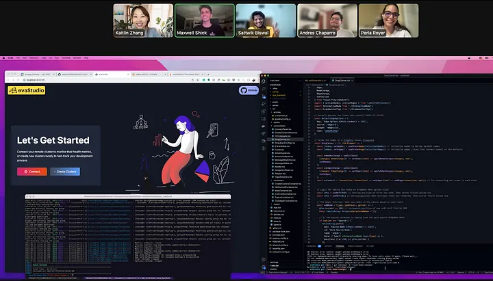

> built during my time at [codesmith](https://codesmith.io). this project is no longer maintained.

eva-studio is a browser-based tool for designing and monitoring apache kafka pipelines. i built it with four other developers over four weeks at the [os labs](https://opensourcelabs.io) tech accelerator.

we wanted a way to experiment with small kafka clusters: draw a pipeline, see how the cluster is doing, and try streaming analytics with jupyter or spark before deploying to production.

much of the work was learning how kafka, kafka connect, and kafka streams fit together. our node.js server talked to java spring boot microservices to stream and transform the data.

there's more about the build in our [project write-up](https://medium.com/@evaStudio/evastudio-v0-1-bd3d98afbf20).

_the team during development_
